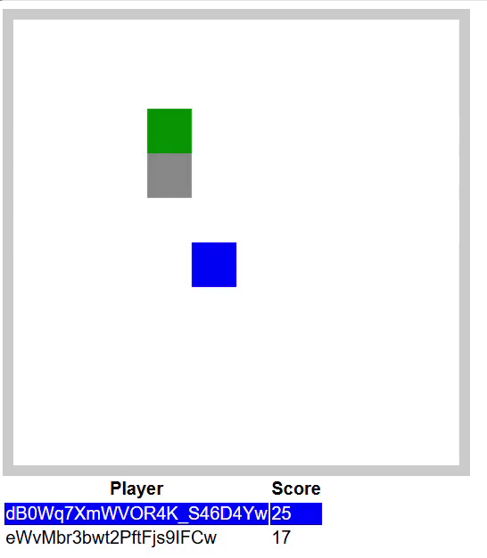

### Champs Game 
Welcome to Champs Game, the most fun game in development.

## Overview

This project is a small game developed to refresh the use of SignalR and .Net 8. It also incorporates the use of TimeProvider for testing purposes, using xUnit and FakeItEasy.

You can play online using the keyboard arrows on https://pedrobarbiero.github.io/ChampsGame/. Invite your friends!

The server is on a free AppService plan on Azure, so the first time you access it it should take a few seconds to load. If it takes too long, refresh the page.

## How to run local

`git clone https://github.com/pedrobarbiero/ChampsGame.git`

`cd ChampsGame`

### Run using docker

`docker-compose build && docker-compose up -d`

Access http://localhost:8200/

### Run using .Net 8

`dotnet build`

Run server:

`dotnet run --project src/Champs.Server`

Run client:

`dotnet run --project src/Champs.Client`

Access http://localhost:8200/

### How to run tests

`dotnet test`

## Author

| [ @pedrobarbiero](https://github.com/pedrobarbiero) |
| :---: |